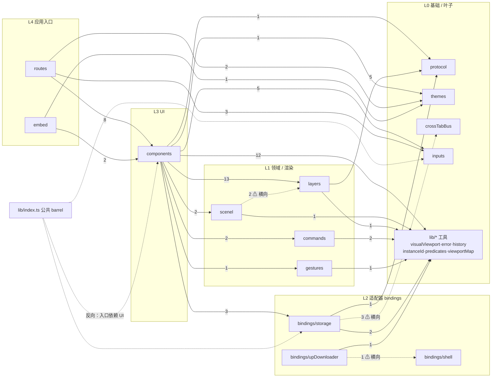

# gpen-js 架构与依赖基线

> 人可读的**索引与判断**，不是 wiki 正文的副本。
> 数据来源：`.repowise/` 索引（`repowise init --yes --no-prose`，结构模式无 LLM）+
> `.repowise/wiki.db` 结构化查询 + `repowise context / export / dead-code / doc-drift`。
> 细节请直接 `repowise context <path>`，不要在这份文件里找函数级说明。
>
> 快照时间：2026-09-26（HEAD `64f665d`）。重构编排见 `tmp/refactor.README.md`，
> 逐 Step 的任务边界见 `tmp/refactor.step*.md`。

---

## 1. 模块地图：`src/lib/` 各领域目录

职责一句话。每条的权威定义在对应目录的文件头注释或 `docs/*.md`。

| 目录 | 职责（一句话） | 关键入口 / 证据 |
|---|---|---|
| `bindings/` | **target 适配层**：把浏览器 / VS Code / 宿主网页的差异收敛成同一组接口，上层只认这套接口 | `src/lib/bindings/storage/index.ts`（`createRuntimeStorage`）、`bindings/upDownloader/index.ts`、`bindings/shell/symlink.ts` |
| `bindings/storage/` | 键值 + Blob 存储：`kv.ts` 的路径树代理、`blob.ts`、`opfs.ts`、`vscode.ts`、`tabBusBlob.ts`、FlatBuffers 二进制 `gpenBinary.ts` | `src/lib/bindings/storage/kv.ts:130`（`KvStorage` 类型）、`docs/storage.md` |
| `bindings/upDownloader/` | 上传/下载目标的文件选择器与传输桥（browser / VS Code webview） | `src/lib/bindings/upDownloader/vscode.ts`、`docs/build-targets.md` |
| `bindings/shell/` | 宿主 shell 能力（目前只有建符号链接 `symlink.ts`） | `src/lib/bindings/shell/symlink.ts` |
| `protocol/` | gpen-protocol 编解码边界：FlatBuffers `GpenT` / `ToolbarStateT` 的 encode/decode、常量与默认值 | `src/lib/protocol/codec.ts`、`constants.ts`、`defaults.ts`、`docs/flatbuffers.md` |
| `layers/` | 图层领域模型与纯行为：协议文档 ↔ UI 图层树适配、图层增删、描边写入、视图投影、`text/html` 网页图层识别（`web.ts`）；`tree/` 是纯图层树行为（扁平化 / 键盘 / 选择 / 拖放 / 搜索） | `src/lib/layers/layerAdapter.ts`（FBS-007）、`strokeOps.ts`、`layerView.ts`、`web.ts`、`layers/tree/index.ts`、`docs/tree.md` |
| `scenel/` | 场景级渲染面（原 `canvas/`，命名决策见下）：无限画布相机 spacer（`infiniteCanvas.ts`）、描边绘制面（`strokeCanvas.ts`）。视口 ↔ 层局部坐标换算在 `layers/layerView.ts`，不在这里 | `src/lib/scenel/index.ts`、`docs/stroke.md` |
| `components/` | 全部 Svelte 组件与 UI 状态（见 §2 细分）；`areas/` 是 Blender 语义的面板，`widgets/` 是表单控件，`contextMenu/` 右键菜单，`codeArea/` 文本区外壳 | `src/lib/components/GpenWorkspace.svelte` |
| `crossTabBus/` | 跨标签页消息层：`base.ts` 定义协议，`sameOriginBus`（BroadcastChannel）/ `crossOriginBus`（Penpal），`createTabBus` 按场景选实现 | `src/lib/crossTabBus/index.ts`、`docs/storage.md` |
| `gestures/` | DOM 交互手势 action（目前 `draggable.ts`：指针拖拽 + 视口边界夹取 + 点击检测） | `src/lib/gestures/draggable.ts` |
| `inputs/` | DOM/Svelte 无关的输入数学：按光标位权的数值步进（`numericCaret.ts`）、拖动换算（`numericScrub.ts`）、单位注册表（`units.ts`）、CodeMirror 数值插件 | `src/lib/inputs/numericCaret.ts`、`docs/input.md` |
| `commands/` | 键盘命令层：`commands.ts` 是 menu/keymap 共用的 id 空间，`keymap.ts` 分发，`chord.ts` 解析按键组合 | `src/lib/commands.ts`、`docs/commands.md` |
| `themes/` | 设计 token 与主题：`day-night.css` 静态 token，`theme.ts` 读取/写入，`theme.svelte.ts` 响应式包装 | `src/lib/themes/theme.ts`、`docs/theme.md` |
| `lib/*.ts`（目录根） | 跨领域小工具：`visualViewport.ts`（视觉视口坐标系，DOM 只碰一次）、`error.ts`、`instanceId.ts`、`predicates.ts`、`viewportMap.ts`（小地图投影数学）、`history.ts`（状态预算式 undo）、`commands.ts` | 文件头注释 |

> **命名决策（Step 4-3）：`canvas/` → `scenel/`。** 判据是「`canvas/` 能否与
> gpen-protocol（Blender）图层模型一一对应」，结论是**不能**：
>
> - 协议侧（`gpen-protocol/protocol/v1/gpen/*.tsp`）没有 canvas / scene /
>   viewport / surface 实体；图层容器是 `Gpen` 数据块（`Gpen.layers` /
>   `Gpen.groups` / `Gpen.nodes` + `child_indices`，由 `LayerTreeNode.item_index`
>   / `parent_index` 索引），不是画布。
> - 图层种类在图层负载上表达：`Layer.mime_type`（`text/html` |
>   `application/gpen`）与 `Layer.render_by`（`js` | `wgpu`），不在渲染面上。
> - 「一个 canvas 装多层 layers」的前提不成立：`strokeCanvas.ts` 渲染的是**一个**
>   `LayerView` 的笔画（不是图层容器）；`infiniteCanvas.ts` 是页面级滚动 spacer
>   （相机），协议里没有对应物。
> - 真正的「视口 ↔ 层局部」换算在 `layers/layerView.ts`（`mapLayerPoint` /
>   `unmapClientPoint` / `pivotAtViewportCenter`）。
>
> 因此这里只保留「图层显示在哪里」的场景级渲染面（相机 spacer + 笔画绘制面），
> 取 `scenel`（scene-level）以避开 HTML `<canvas>` 的歧义；域名模型归 `layers/`。

`src/lib/index.ts`（24 行）是**公共 barrel**，用 `package.json#imports` 暴露为 `#lib`：

```jsonc
// package.json
"imports": { "#lib": "./src/lib/index.js", "#lib/*": "./src/lib/*" }
```

约定：`src/` 内部一律用 `#lib/<子路径>`，**没有任何代码 import 裸 `#lib`**（验证：`rg -n "from ['\"]#lib['\"]" src tests` 无输出）。因此 barrel 只是对外 API，不参与内部依赖。

---

## 2. 分层视图：repowise 的 layer ↔ 真实目录

repowise 自动分层的结果（`knowledge-graph.json#layers`，8 层）：

| repowise layer | 文件数 | 对应的真实目录 / 文件 |
|---|---|---|
| **UI** (`layer:ui`) | 46 | `src/lib/components/**` 全部（`.svelte` + 组件旁 `.ts`） |
| **API** (`layer:api`) | 4 | `src/routes/+layout.svelte`、`+layout.ts`、`+page.svelte`、`storage-broker/+page.svelte` |
| **Application** (`layer:application`) | 27 | 仓库根配置（`package.json`、`vite*.config.ts`、`tsconfig*.json`、`.oxlintrc.json`、`.mcp.json`）、`AGENTS.md` / `README.md` / `TODO.md`、`rules/**`、`messages/*.json`、`project.inlang/settings.json`、`src/app.d.ts`、`src/hooks*.ts`、`src/embed/**` |
| **Config** (`layer:config`) | 3 | `.husky/{commit-msg,pre-commit,pre-push}` |
| **CLI** (`layer:cli`) | 2 | `src/lib/commands/chord.ts`、`keymap.ts` |
| **Service** (`layer:service`) | 61 | `src/lib/**` 其余全部（bindings / scenel / crossTabBus / gestures / inputs / layers / protocol / themes / lib 根工具 / barrel） |
| **Docs & Tooling** (`layer:docs-tooling`) | 32 | `docs/*.md`、`scripts/*.ts`、`src/routes/demo/**` |
| **Test** (`layer:test`) | 52 | `tests/**` + `tsconfig.test.json` |

### repowise 自动分层的误判（要按真实结构读）

1. **`commands/` 被标成 `CLI`**。它根本不是命令行——`commands.ts` 是菜单栏 / 键位 / 设置面板共用的**命令 id 空间**，由 `components/contextMenu/menuModel.ts`（菜单树只引用 `getCommand` / `commandEnabled`，从不执行）、`components/workspaceCommands.ts`（`registerCommand`）和 `commands/keymap.ts`（`executeCommand`）消费（`src/lib/commands.ts` 文件头：“Command registry: the single id space shared by the menu bar, the keymap, and the settings panel”）。它是 UI 领域逻辑，不是 CLI。
2. **仓库配置 / 文档被标成 `Application`**。`AGENTS.md`、`README.md`、`TODO.md`、`package.json`、`vite*.config.ts`、`tsconfig*.json`、`.oxlintrc.json`、`messages/*.json`、`project.inlang/settings.json`、`rules/**` 全部落在 `Application` 层——按名字像“应用逻辑”，实际是**构建/文档/工具配置**。`Application` 这一桶里真正的运行时代码只有 `src/hooks*.ts`、`src/app.d.ts`、`src/embed/**`。
3. **`src/routes/` 被标成 `API`**。SvelteKit 路由不是后端 API，而是应用 shell + 入口页面；`+layout.ts` 只有 `ssr = false / prerender = true`。
4. **`src/embed/index.ts` 未被认作入口**。`project.entry_points` 只有 3 个 routes（`knowledge-graph.json#project`），但 embed 是**独立构建目标**（`vite.embed.config.ts` + `package.json#exports["./embed"]`），入口是 `src/embed/index.ts`，只是没有被 SvelteKit 路由图连上。
5. **demo 路由被标成 `Docs & Tooling`**（`src/routes/demo/**`）。语义上它们是“可运行的文档”，但物理上仍是应用路由，和 `routes` 目录同源。
6. **`Service` 层过粗**：`src/lib/` 下 12 个语义完全不同的领域目录（protocol / layers / scenel / storage / inputs / themes…）全被压成一层。要拿真实边界，看 §3 的直连边 + `graph_metrics.community_id`（社区检测），不要看 layer 名。

入口点识别也偏噪：`graph_nodes.is_entry_point=1` 把 `tests/*.test.ts`、`scripts/*.ts`、`src/routes/demo/*/+page.svelte` 都算了进去（它们确实是各自子图的根），`project.entry_points` 才是人工口径。

---

## 3. 依赖边：跨目录 import（`graph_edges.edge_type='imports'`）

统计口径：`graph_edges` 中 `edge_type IN ('imports','dynamic_imports')`、两端都是真实文件节点的边，按**目录**聚合；数字 = 文件级边数。



（`tests →` 全目录的边不画：`tests/` 直连 protocol 18、components 12、layers 12、lib 根工具 6、storage 6 等，属正常测试面。`package.json → src/**` 的 4 条是 `exports` 字段被当作 import 解析。）

### 3.1 同图的数据表（含判定）

| 方向 | 边数 | 判定 |
|---|---|---|
| components → layers / utils / inputs / storage / scenel / commands / gestures / protocol / themes | 13/12/5/3/2/2/1/1/1 | ✅ 正向（UI 依赖领域与适配器） |
| routes → components / inputs / themes | 8/3/2 | ✅ 正向（应用入口依赖 UI） |
| embed → components / themes | 2/1 | ✅ 正向（embed 也是应用入口） |
| scenel → layers | 2 | ⚠ **横向**（同属 L1，渲染依赖领域模型，当前单向） |
| scenel → utils | 1 | ✅ 正向 |
| layers → protocol / utils | 5/1 | ✅ 正向（领域依赖叶子） |
| commands → utils | 2 | ✅ 正向 |
| gestures → utils | 1 | ✅ 正向 |
| storage → protocol / utils | 1/2 | ✅ 正向 |
| storage → crossTabBus | 3 | ⚠ **横向**（适配器依赖消息层；见 §3.2） |
| upDownloader → shell | 1 | ⚠ **横向**（bindings 子域互相依赖，见 §3.2） |
| upDownloader → utils | 1 | ✅ 正向 |
| `lib/index.ts`（barrel）→ components / inputs / storage / … | 1+4+1+… | ⚠ **反向**（最低层的公共入口依赖最高层 UI，见 §3.2） |

### 3.2 需要标注的边

**反向依赖：公共 barrel 依赖 UI 层。** `src/lib/index.ts` 是全库的对外入口，却 `export *` 了 `./components/gpenWorkspaceState.js` 和 `./components/contextMenu/contextMenu.svelte.js`：

```bash
$ rg -n 'components|inputs/codemirror' src/lib/index.ts
14:export * from "./inputs/codemirror/index.js";
18:export * from "./components/gpenWorkspaceState.js";
19:export * from "./components/contextMenu/contextMenu.svelte.js";
```

后果：任何 `import ... from '#lib'` 的外部消费者都会连带把 Svelte 组件状态层和 CodeMirror 拉进依赖图。目前仓内代码不用裸 `#lib`，所以没有形成环；但这是 barrel 层唯一一处“入口依赖实现”。Step 4-5 冻结了导出名集合（只许改路径），所以**不要在重构中顺手删**——记到 Step 4 的决策表里。

**横向依赖（非反向、非环，但耦合点值得知道）：**

- `bindings/storage → crossTabBus`（3 条）：`gpenBinary.ts`、`opfs.ts`、`tabBusBlob.ts` 都 import `crossTabBus/index.ts`，用广播做跨标签页的 blob 同步。消息层本可视为 storage 的协作层，但结果是**存储适配器无法脱离 crossTabBus 单独测试/移植**。
- `scenel → layers`（2 条）：`scenel/strokeCanvas.ts` import `layers/layerView.ts`（坐标映射）与 `layers/strokeOps.ts`（`StrokePointInput`）。当前单向；若 layers 反手需要 scenel 类型就会成环。
- `bindings/upDownloader → bindings/shell`（1 条）：`upDownloader/vscode.ts` import `shell/symlink.ts`，两个 target 适配器绑在一起。Step 4-2 拆 `upDownloader` 时要一并决定 `shell` 的归属。

**没有反向依赖的“下钻”**：`protocol`、`crossTabBus/base.ts`、`themes`、`inputs` 的入边都只来自上层，出边只有外部包，是干净的叶子（证据：`repowise context <path> --include callees` 的 callees 列表）。

---

## 4. 已知循环：`kv.ts ↔ types.ts`（唯一一处）

**全仓 `src/` 的 import 图只有一个强连通分量（SCC），大小 2。** 用 Tarjan 扫 `graph_edges` 的 `imports` 边确认：

```bash
$ python3 - <<'PY'
import sqlite3, collections, sys
c = sqlite3.connect('.repowise/wiki.db')
rows = [(s, t) for s, t in c.execute(
    "select source_node_id,target_node_id from graph_edges where edge_type in ('imports','dynamic_imports')")
    if not t.startswith('external:') and '::' not in s and '::' not in t]
g = collections.defaultdict(set)
for s, t in rows: g[s].add(t)
...  # Tarjan
PY
# 输出：SCCs with >1 node: 1
#   src/lib/bindings/storage/kv.ts
#   src/lib/bindings/storage/types.ts
```

成因（两行 `import type`，运行时会被擦除，所以是**类型级环，不是运行时环**）：

```ts
// src/lib/bindings/storage/types.ts:1
import type { KvStorage } from "./kv.js";
// src/lib/bindings/storage/kv.ts:1
import type { JsonValue, KvBackend } from "./types.js";
```

repowise 的 `refactoring_suggestions` 里也报了同一处：

```bash
$ python3 -c "import sqlite3;print(*sqlite3.connect('.repowise/wiki.db').execute(
  \"select file_path,target_symbol,plan_json,confidence from refactoring_suggestions where refactoring_type='break_cycle'\"),sep='\n')"
# file_path: src/lib/bindings/storage/kv.ts
# target_symbol: cycle[2]: types.ts->kv.ts
# plan_json: {"cycle":[...], "cut_edges":[{"from":"src/lib/bindings/storage/types.ts","to":"src/lib/bindings/storage/kv.ts"}]}
# confidence: high
# blast_radius: {"files":["kv.ts","types.ts"],"file_count":2,"callers":14}
```

wiki 里也生成了 SCC 页 `Circular Dependency: Bindings Storage`（导出文件 `scc-0383396cadde.md`）：57 个 symbol 在环内，两个文件各带 1 条入环 import。

**建议断点**：切 `types.ts → kv.ts`（repowise 的推荐），即让 `type.ts` 不再从 `kv.ts` 取 `KvStorage`。最自然的做法是把 `kv.ts:3–142` 的类型面（`StoragePathKey`、`Kv*HookContext`、`KvStorageProxy`、`KvStorageOptions`、`KvStorage` 及其辅助类型，共约 140 行）搬进 `types.ts`（它本来就是“storage 的类型模块”），让方向变成单向 `kv.ts → types.ts`。备选：新建 `kvTypes.ts` 放这批类型，`kv.ts` 与 `types.ts` 都从它导入。**注意**：这两条边都是 `import type`，不影响运行时；改动的收益是可读性与可抽取性，代价是 140 行搬迁，建议搭 Step 2-1（storage）或 Step 4-1（storage 审查）一起做，不要单独夹带。

除此之外**没有其他循环**：`src/` 下没有自环，目录级没有 A→B 且 B→A 的 import 对（只有 `co_changes` 这类历史共改边是双向的）。

---

## 5. 入口点

| 入口 | 角色 | 证据 |
|---|---|---|
| `src/routes/+layout.svelte` | SvelteKit 根 layout：`mount(GpenOverlay, { target: document.body })` **只挂一次**，注入 `app.css`，初始化主题 / 偏好 / 右键菜单 | `src/routes/+layout.svelte`；`AGENTS.md`「GpenOverlay 只在根 layout 挂一次」 |
| `src/routes/+page.svelte` | 主页面（客户端渲染的落地页 + demo 链接） | `src/routes/+page.svelte` |
| `src/routes/storage-broker/+page.svelte` | OPFS 存储 broker：跑在 iframe 里，用 `CrossOriginBus` 向父窗口提供 `createOpfsBlobBroker` | `src/routes/storage-broker/+page.svelte:1-40` |
| `src/embed/index.ts` | **embed 单文件库入口**：把 `GpenOverlay` + `ContextMenu` 挂进 ShadowRoot，导出 `GPEN_HOST_ID` / `mountGpen` / `unmountGpen` / `isGpenMounted`；构建目标 `vite.embed.config.ts`，产物 `dist/embed/gpen-embed.js` | `src/embed/index.ts`、`package.json#exports["./embed"]`、`docs/build-targets.md` |

另外 `src/hooks.client.ts` 用一行静态 import 注册 Custom Element `GpenPanel.web.svelte`，`src/lib/components/GpenOverlay.svelte` 是 UI 的实际根组件——但它们是“被 layout 挂载的实现”，不是构建入口。

`repowise project.entry_points` 只列了前 3 个 routes；embed 见 §2 误判 4。

---

## 6. 热点与风险 Top 表

两个口径要分清（`tmp/refactor.README.md` 也有说明）：

- **门禁口径** `repowise health --scope production --counts code_shape`：只判代码形状，**去掉 git 历史项**。这是 `bun run health:gate` 的依据，也是 Step 2/3 的验收依据。README 基线（2026-09-24）：125 findings（critical 8 / high 17 / medium 52 / low 48），`hotspot_health` 8.58、`average_health` 8.82。
- **全信号口径** `.repowise/wiki.db` 的 `health_file_metrics` / `health_findings`：含历史 / 覆盖率，分数更低，用于找“长期热点”，**不要**拿它当门禁。

### 6.1 最差健康分（`health_file_metrics`，`is_test=0`，全信号）

```bash
$ python3 -c "import sqlite3;print(*sqlite3.connect('.repowise/wiki.db').execute(
  'select file_path, round(score,2), max_ccn, max_nesting, nloc, round(coalesce(duplication_pct,0),1) '
  'from health_file_metrics where is_test=0 order by score asc limit 20'),sep='\n')"
```

| 文件 | score | max_ccn | max_nesting | nloc | dup% | 哪个 Step 处理 |
|---|---|---|---|---|---|---|
| `src/lib/components/widgets/inputs/InputNumber.svelte` | 2.50 | 31 | 3 | 483 | 0.0 | **Step 3-1** |
| `src/lib/components/areas/Outliner.svelte` | 2.60 | 11 | 2 | 337 | 1.5 | **Step 3-3** |
| `src/lib/components/contextMenu/ContextMenu.svelte` | 2.86 | 13 | 2 | 207 | 0.0 | **Step 3-3** |
| `src/lib/components/GpenWorkspace.svelte` | 3.28 | 10 | 2 | 734 | 4.7 | **Step 3-2** |
| `src/lib/bindings/upDownloader/vscode.ts` | 3.35 | **64** | 5 | 578 | 28.4 | **Step 2-7**（拆函数）/ **Step 4-2**（target 拆分） |
| `src/lib/components/widgets/inputs/InputSlider.svelte` | 4.09 | 10 | 3 | 188 | 0.0 | **Step 3-1** |
| `src/lib/components/gpenWorkspaceState.ts` | 4.21 | 12 | 3 | 272 | 8.9 | **Step 2-4** |
| `src/lib/components/areas/{Timeline,TopBar,Viewport}.svelte` | 4.50 | 1–5 | 0–2 | 26–90 | 0.0 | **Step 3-4** |
| `src/lib/components/contextMenu/contextMenu.svelte.ts` | 4.50 | 8 | 2 | 273 | 0.0 | **Step 3-3** |
| `src/routes/demo/widgets/+page.svelte` | 4.50 | 1 | 0 | 83 | 0.0 | **Step 3-5** |
| `src/lib/gestures/draggable.ts` | 4.64 | 3 | 1 | 243 | 0.0 | **⚠ 无 Step 认领**（见 §6.5） |
| `src/lib/components/areas/Properties.svelte` | 4.79 | 3 | 1 | 83 | 8.3 | **Step 3-4** |
| `src/lib/components/GpenOverlay.svelte` | 4.94 | 5 | 2 | 107 | 0.0 | **Step 3-4** |
| `src/lib/canvas/webLayer.ts` | 5.30 | 12 | 3 | 107 | 0.0 | **Step 2-6** |
| `src/lib/components/workspaceCommands.ts` | 5.33 | 3 | 2 | 181 | **54.5** | **Step 2-4** |
| `src/lib/bindings/storage/vscode.ts` | 5.85 | 17 | 3 | 399 | 33.1 | **Step 2-1** / **Step 4-1** |
| `src/lib/bindings/storage/opfs.ts` | 6.01 | 11 | 2 | 259 | 14.9 | **Step 2-1** / **Step 4-1** |
| `src/lib/components/areas/Preferences.svelte` | 6.15 | 2 | 1 | 165 | 28.3 | **Step 3-4** |

### 6.2 最高圈复杂度（`health_file_metrics.max_ccn`）

| 文件 | max_ccn | code_shape score（README 基线） | 哪个 Step 处理 |
|---|---|---|---|
| `src/lib/bindings/upDownloader/vscode.ts` | 64 | 5.94（最差） | Step 2-7 / 4-2 |
| `src/lib/components/widgets/inputs/InputNumber.svelte` | 31 | 6.0 | Step 3-1 |
| `src/lib/inputs/numericCaret.ts` | 28 | — | Step 2-3 |
| `src/lib/bindings/storage/gpenBinary.ts` | 26 | — | Step 2-1 / 4-1 |
| `src/lib/layers/layerAdapter.ts` | 18 | 6.0 | Step 2-2 / 4-3 |
| `src/lib/bindings/storage/vscode.ts` | 17 | — | Step 2-1 / 4-1 |
| `src/lib/layers/tree/keyboard.ts` | 17 | — | Step 2-2 |
| `src/lib/bindings/storage/kv.ts` | 16 | — | Step 2-1 / 4-1 |
| `src/lib/layers/strokeOps.ts` | 16 | — | Step 2-2 / 4-3 |
| `src/lib/bindings/storage/tabBusBlob.ts` | 13 | — | Step 2-1 / 4-1 |

### 6.3 `large_method`（NLOC ≥ 60 且 CCN ≥ 3）——门禁 FAIL 项

`bun run health:gate` 当前失败（`tmp/gate-final.log`），共 **16** 处 `large_method`（critical 3 / high 3 / medium 2 / low 8），另有 `brain_method` 2、`complex_method` critical|high 11、`nested_complexity` high 1、`low_cohesion` high 1。按 severity：

| 文件::函数 | severity | NLOC | CCN | 哪个 Step |
|---|---|---|---|---|
| `bindings/storage/gpenBinary.ts::createGpenBinaryStore` | critical | 221 | 26 | Step 2-1 / 4-1 |
| `bindings/upDownloader/vscode.ts::createVscodeUploadDownloadSelector` | critical | 269 | 64 | Step 2-7 |
| `components/gpenDocumentSession.svelte.ts::createGpenDocumentSession` | critical | 311 | 8 | Step 3-2 |
| `bindings/storage/blob.ts::createBlobBackend` | high | 153 | 5 | Step 2-1 |
| `bindings/storage/kv.ts::createKvRuntime` | high | 190 | 16 | Step 2-1 |
| `canvas/strokeCanvas.ts::createStrokeCanvas` | high | 191 | 5 | Step 2-6 |
| `bindings/storage/opfs.ts::createOpfsTabBusBlobBackend` | low | 85 | 11 | Step 2-1 |
| `bindings/storage/tabBusBlob.ts::createTabBusBlobBackend` / `createTabBusBlobBroker` | low | 84 / 62 | 13 / 12 | Step 2-1 |
| `bindings/storage/vscode.ts::createWebviewBridge` | low | 74 | 7 | Step 2-1 |
| `bindings/upDownloader/vscode.ts::createVscodeFileTransferBridge` | low | 66 | 7 | Step 2-7 |
| `layers/layerOps.ts::createDrawingLayer` | low | 65 | 13 | Step 2-2 |
| `components/widgets/inputs/InputNumber.svelte::handleKeydown` | low | 65 | 31 | Step 3-1 |
| `components/GpenWorkspace.svelte::onMount callback` | low | 64 | 5 | Step 3-2 |
| `components/workspaceCommands.ts::registerWorkspaceCommands` | medium | 108 | 3 | Step 2-4 |
| `layers/layerAdapter.ts::buildLayerTree` | medium | 111 | 18 | Step 2-2 |

### 6.4 重构建议（`refactoring_suggestions`，45 条）

按类型：`extract_helper` 26、`extract_method` 14、`split_file` 4、`break_cycle` 1。

| 类型 | 文件 | 目标 / 分组数 | 哪个 Step |
|---|---|---|---|
| `break_cycle` | `bindings/storage/kv.ts` | `cycle[2]: types.ts->kv.ts`（cut `types.ts→kv.ts`） | Step 2-1 / 4-1（见 §4） |
| `split_file` | `inputs/numericCaret.ts` | 5 组，31 symbols，依赖 7 文件 | Step 2-3 |
| `split_file` | `bindings/storage/vscode.ts` | 4 组，16 symbols | Step 2-1 / 4-1 |
| `split_file` | `layers/strokeOps.ts` | 5 组 | Step 2-2 / 4-3 |
| `split_file` | `bindings/storage/kv.ts` | 3 组 | Step 2-1 / 4-1 |
| `extract_*` 最多 | `bindings/storage/vscode.ts`（5）、`bindings/storage/blob.ts`（5）、`layers/strokeOps.ts`（3）、`commands/chord.ts`（2）、`components/menuBar.ts`（2）、`components/workspaceFloatingDrag.ts`（2） | — | 对应 Step 2-1 / 2-2 / 2-5 / 2-4 |

### 6.5 覆盖率缺口（需要 1-1 的 `repowise coverage add` 才生效）

`tmp/health-final.json`（2026-09-26，`--counts code_shape`，142 个 production 文件）显示覆盖率接入后暴露的高缺口：`gestures/draggable.ts` 11%（228/257 行未覆盖，`coverage_gap` high）、`layers/layerView.ts` 38%、`layers/tree/types.ts` 0%。这些是**测试缺口**，不是 Step 2/3 的复杂度任务——`draggable.ts` 目前无人认领。

---

## 7. 怎么复现

```bash
cd /home/n/document/code/gpen/gpen-js

# 1) 单文件 triage：层级 / 调用方 / 被调用方 / 指标 / 健康度 / 生物标记
repowise context src/lib/bindings/storage/kv.ts \
  --include callers --include callees --include metrics --include health

# 2) 导出 216 页 wiki（结构模式；`repowise ask` / prose 需要模型 key，本项目当前环境 401，别用）
repowise export --format markdown -o /tmp/repowise-export
find /tmp/repowise-export -name '*.md' | wc -l      # 216

# 3) 架构模型（目录级组件图 + 关系，真实的 “layer → 目录” 映射在这里）
repowise export --format structurizr --components -o /tmp/repowise-arch.dsl
rg '^\s+cmp_.*->.*imports' /tmp/repowise-arch.dsl

# 4) 死代码 / 文档漂移（只读）
repowise dead-code      # 36 findings，10 个 unreachable_file（多是 config/hook 这类无 import 的根）
repowise doc-drift      # 7 findings：docs/build-targets.md:107、docs/flatbuffers.md:32/33/43/44/45、docs/panel.md:472

# 5) sqlite：跨目录依赖边（§3 的原始数据）
python3 - <<'PY'
import sqlite3, collections
c = sqlite3.connect('.repowise/wiki.db')
rows = c.execute("select source_node_id,target_node_id from graph_edges "
                 "where edge_type in ('imports','dynamic_imports')")
def area(p):
    if not p or p.startswith('external:') or '::' in p: return None
    parts = p.split('/')
    if parts[0] == 'src':
        if len(parts) > 2 and parts[1] == 'lib':
            return parts[2] if len(parts) > 3 else 'lib'
        return parts[1]
    return parts[0]
agg = collections.Counter((area(s), area(t)) for s, t in rows)
for (a, b), n in agg.most_common():
    if a and b and a != b: print(f'{a:22s} -> {b:22s} {n}')
PY

# 6) sqlite：健康度与生物标记（§6）
python3 -c "import sqlite3;c=sqlite3.connect('.repowise/wiki.db');\
print(*c.execute('select file_path, round(score,2), max_ccn, nloc from health_file_metrics '
                 'where is_test=0 order by max_ccn desc limit 20'), sep='\n')"
python3 -c "import sqlite3;c=sqlite3.connect('.repowise/wiki.db');\
print(*c.execute(\"select file_path,function_name,severity,"
  \"json_extract(details_json,'\$.nloc'),json_extract(details_json,'\$.ccn') \"
  \"from health_findings where biomarker_type='large_method' order by severity\"), sep='\n')"

# 7) 找循环（§4 的 Tarjan；或直接看 wiki 的 SCC 页）
rg -n 'from' /tmp/repowise-export/scc-0383396cadde.md
```

门禁与基线（与 `tmp/refactor.step1-1.md` 一致）：

```bash
bun run health            # repowise health --format md --scope production --counts code_shape
bun run health:gate       # 退出码非 0 = 不合格；-- --module src/lib/layers 限定范围
```

---

## 8. 证据与相关文档

- **本文件的数据快照**：`.repowise/knowledge-graph.json`（8 layers / 7 modules / tour / edges，`total_files: 227`）、`.repowise/wiki.db`（`graph_edges` 572 imports、`health_file_metrics`、`health_findings` 529（README 快照为 510）、`refactoring_suggestions` 45（README 快照为 44）、`wiki_pages` 216（README 快照为 211））。
- **重构编排**：`tmp/refactor.README.md`（Step 总览 + 度量口径 + 全局约束）；各 Step 的范围与验收见 `tmp/refactor.step*.md`。
- **模块边界的社区证据**：`tmp/refactor.step4-5.md`（`graph_metrics.community_id` 的逐目录社区分布；结论：`components/` 顶层 20 文件跨 5 社区、`areas/` 9 文件跨 4 社区，但 `workspace*` 前缀不等于同一模块）。
- **健康度门禁**：`tmp/refactor.step1-1.md`、`scripts/health-gate.ts`、`tmp/health-baseline.md`、`tmp/health-final.json`、`tmp/gate-final.log`。
- **项目约定**：`AGENTS.md`（组件 / 目录 / 导入 / 样式 / 文件体量规则）、`docs/glossary.md`（术语）。
- **契约文档**（`src/` 引用 `docs/*.md` 共 49 处）：`docs/storage.md`、`docs/todo-safe.md`（存储信任模型）、`docs/flatbuffers.md`、`docs/layer-view.md`、`docs/tree.md`、`docs/input.md`、`docs/panel.md`、`docs/build-targets.md`。
